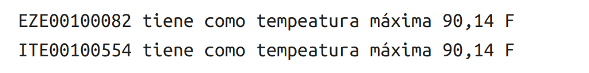

# 5 Práctica: Temperaturas sensor

1. [Arrancar Zeppelin ](#schema1)
2. [Importación de librerías ](#schema2)
3. [Cargar ficheros ](#schema3)
4. [Procesar la inforamción cargada en RDD](#schema4)
5. [Aplicar "procesarLinea"](#schema5)
6. [Imprimir valores](#schema6)

# 1. Arrancar Zeppelin
Navegamos en la consola hasta llegar donde tenemos descargados la carpeta Zeppelin y ejecutamos:
~~~
bin/zeppelin-daemon.sh start
~~~

Seguidamente abrimos un página en el navegador y vamos a `http://localhost:8080`, se nos abre zeppelin y creamos un nuevo notebook, llamado Temperatura Sensor y como intérprete elegimos `spark2`

# 2. Importación de librerías

~~~scala
import org.apache.spark._
import scala.math.max
~~~

# 3. Cargar ficheros

~~~scala
val lineas = sc.textFile("file:///home/patricia/Documentos/scala/5-Temp-sensor/data/1800.csv")
~~~
sc = spark context, entidad que nos comunica con el cluster
lineas es un RDD

# 4. Procesar la inforamción cargada en RDD
1º Creamos una función en la que vamos a procesar las línea del archivo `lineas`
La estación de Metereología esta en el primer campo de csv, el tipo de información en el tercero y la temperatura que esta en ºF en el cuarto campo, al estar al temperatura en ºF los pasamos a ºC
~~~scala
def procesarLinea(linea:String) = {
    val campos = linea.split(",") //array
    val estacionMeteo = campos(0)
    val tipoInfo = campos(2)
    val temp = campos(3).toFloat * 0.1f * (9.0f/5.0f)+ 32.0f
    (estacionMeteo,tipoInfo,temp)// return(estacionMeteo,tipoInfo,temp) 
}
~~~
Se puede poner o no el return, ya que en scala se devuelve siempre la útlima linea escrita dentro de una función.

# 5. Aplicar "procesarLinea" 
Vamos a aplicar la función `procesarLinea` a las líneas del archivo para obtener un nuevo RDD con el vamos a trabajar y obtener las temperaturas máximas.

~~~scala
val lineasProcesada = lineas.map(procesarLinea)
~~~

Ahora a las `lineasProcesada` nos vamos a quedar solo con las temperaturas máximas `TMAX` por eso le hacemos un filter, en el `tipoInfo` estan esos valores y es la posición 2 de la tupla que devuelve la función `procesarLinea`.
~~~scala
val tempMax = lineasProcesada.filter(elemento => elemento._2 == "TMAX")
~~~

Ahora vamos a buscar las temperaturas máximas de las estaciones
~~~scala
val estacionYTemp = tempMax.map(elemento => (elemento._1, elemento._3.toFloat))//el valor de la temperatura lo pasamos a Float
~~~

Podemos usar un  `reduceByKey` porque ya hemos generado un tupla con dos valores, donde la clave es la estación metereologias y valor la temperatura.

~~~scala
val tempMaxPorEstacion = estacionYTemp.reduceByKey((valor_tupla1,valor_tupla2) => max(valor_tupla1,valor_tupla2))
~~~

# 6. Imprimir valores
Obtenemos un array, también podemos hacer un `.take(20)` y obtendremos los 20 primeros y no todos los datos.

~~~scala
val resultados = tempMaxPorEstacion.collect()
//val resultados = tempMaxPorEstacion.take(20)
~~~
Por lo tanto para imprimirlo tenemos que iterar por él. La temperatura la transformamos aplicandole un formato para que solo nos imprima dos decimales.

~~~scala
for(resultado <-resultados.sorted){
    val estacion = resultado._1
    val temp = resultado._2
    val formatoTemp = f"${temp}%.2f F"
    println(s"${estacion} tiene como tempeatura máxima ${formatoTemp}")
}
~~~

